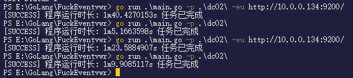
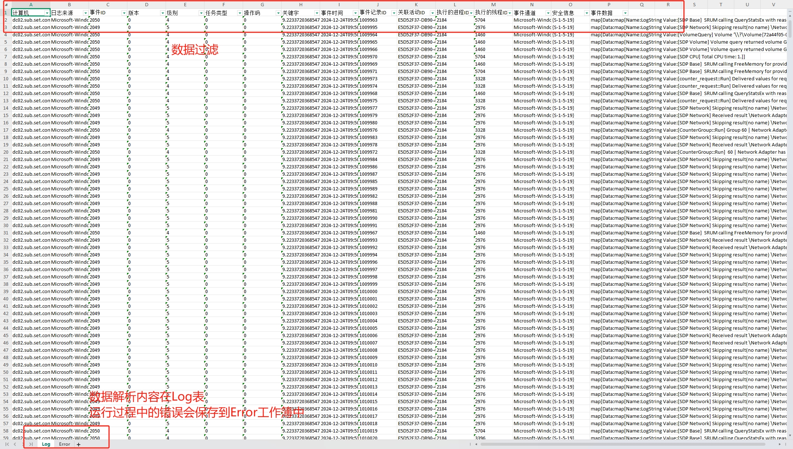
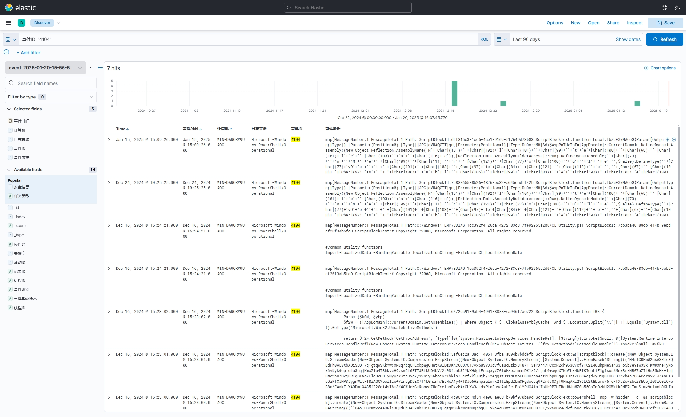

# FuckEventvwr - Evtx日志解析工具

## 简介
Evtx日志解析工具，用于解析Windows事件日志文件（.evtx），提取其中的事件信息，并生成xlsx报告，后续会支持数据导出到Elasticsearch中。下载地址[Releases](https://github.com/BoyChai/FuckEventvwr/releases)。

## 使用
```bash
Usage of FuckEventvwr.exe:
  -eu string
        ESURL,设置ESURL则只往ES中打入数据,默认为空
  -m int
        输出模式,默认0,0为只打印处理好的数据,1则处理好的数据+原始数据都放到一个xlsx中,2则只输出原始数据
  -o string
        输出位置,默认为当前目录的 event-年-月-日-时-分-秒.xlsx (default "event-年-月-日-时-分-秒.xlsx")
  -p string
        指定路径,默认为当前路径,匹配方式是这个路径下的全部evtx文件 (default "./")
  -t string
        指定类型,默认为p,即指定路径模式,s为系统日志 (default "p")
```
直接运行什么也不加,则会解析当前目录所有evtx为后缀的文件。

## 功能
- [x] 解析evtx日志,
- [x] 关键数据导出xlsx
- [x] 导出数据json原始数据到xlsx
- [x] 导出到ES(Elasticsearch)中
- [ ] 本地缓存筛选支持

## 计划
- ~~针对ES导出做优化~~  
- ~~针对本地做数据缓存~~
- 导出方式全部模块化
- 模块动态注册
- 模块参数动态注册

<!-- - 针对powershell执行做数据筛选
- 针对用户创建做数据筛选
- 针对服务创建做数据筛选
- 针对用户登录做筛选
- 针对用户授权筛选
- 支持多种导出方式 -->


## 其他
- 由于xslx的限制，它是有最大限制的，似乎最多就100w行，不建议多个主机日志都丢到一个目录中分析，而是分开目录，分开解析、分析。  
- 本人机器是12500H，50w条数据，大概需要40秒左右，机器更好应该会更快。
下面是70w条数据的时间运行时长，分别是导出本地xlsx，和导出ES中，如图



## 相关截图  


## Stargazers over time
[](https://starchart.cc/BoyChai/FuckEventvwr)
